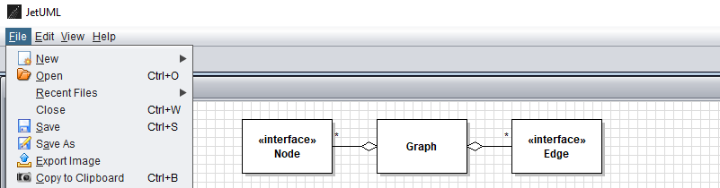

# JetUML

A lightweight desktop application for interactively creating and editing diagrams in the Unified Modeling Language. The idea of JetUML is to support the sketching of software design ideas with a minimum of fuss. Diagrams can be saved in JSON, exported to popular image formats, and copied to the system clipboard for integration with other tools. Currently supports Class diagrams, Sequence diagrams, State diagrams, Object diagrams, and Use case diagrams.

If you find this tool useful please **star the repo**.

## License 

JetUML is available under the terms of the [GNU General Public License v3](https://www.gnu.org/licenses/gpl.html). 

## Download and Installation

JetUML is available both as a self-contained application and as a Java archive file. Download the application from the [latest release](https://github.com/prmr/JetUML/releases) page and if necessary see the [installation guide](docs/install.md). Users upgrading from a previous version might want to peek at the [compatibility guide](docs/compatibility.md)

## Privacy Policy and Feedback

JetUML collects no information whatsoever. We rely on you to estimate usage levels and receive feedback. If you use JetUML, please **star the repo**. If you use the project for teaching or research, please also [let us know](mailto:jetuml@cs.mcgill.ca). 

## Documentation

* [Installation Guide](docs/install.md)
* [User Guide](https://www.jetuml.org/docs/user-guide.html)
* [Compatibility Guide](docs/compatibility.md)
* [Contributing Guidelines](docs/CONTRIBUTING.md)
* [Guide for JetUML Developers](docs/developers.md)
* [Architecture Description](/docs/architecture.md)

## JetUML in the Literature

Articles that refer to JetUML. To include missing references please submit a pull request.

* M.P. Robillard and K. Kutschera. **Lessons Learned in Migrating from Swing to JavaFX**. IEEE Software, 2019. *Reports on the experience of migrating the GUI to JavaFX*. [(pdf)](https://www.cs.mcgill.ca/~martin/papers/software2019.pdf)

* D. Marmsoler and A. Petrovska. **Detecting Architectural Erosion using Runtime Verification**. In Proceedings of the 12th Interaction and Concurrency Experience Workshop, 2019. *Applies a verification method to JetUML*. [(pdf)](https://www.researchgate.net/publication/333748317_Detecting_Architectural_Erosion_using_Runtime_Verification/download)

* Q. Wang, Y. Brun, A. Orso. **Behavioral Execution Comparison: Are Tests Representative of Field Behavior?**. In Proceedings of the 10th IEEE International Conference on Software Testing, Verification, and Validation, 2017. *Analyzes JetUML's test suite*. [(pdf)](https://people.cs.umass.edu/~brun/pubs/pubs/Wang17icst.pdf)

* 	M.P. Robillard. **Sustainable Software Design**. In Proceedings of the 24th ACM SIGSOFT International Symposium on the Foundations of Software Engineering, 2016. *Discusses some of JetUML's design decisions*. [(pdf)](https://www.cs.mcgill.ca/~martin/papers/fse2016.pdf)

