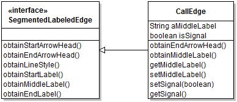
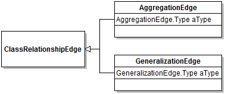

# Edge Hierarchy

## Scope

The edge hierarchy feature concerns how graph edges are specified and handled by the concrete graph classes.

## Design

Any edge in a diagram is an implementor of interface `Edge`. The hierarchy of edges rooted at abstract class `SegmentedLabeledEdge` is customizable through the use of protected methods `obtain...`. 

The idea of the `obtain...` methods is to either override style defaults or provide labels. The `SegmentedLabeledEdge` does not have fields for labels, but offers that possibility
through subclassing and can render the labels uniformly in its `draw` method. In the example above, `CallEdge` redefines the end arrow head but relies on the default value for 
the line style and start arrow head. It provides a single label to be rendered in the middle. Note that the use of the naming scheme `obtain` is purposeful, because `Edge` objects are used
as JavaBeans in other contexts (see `PropertySheet`), and the presence of a `get...` method defines a property. This way, properties can only be defined when they need to be editable. In the case of 
`CallEdge` the class uses the `obtain` hook to make a middle label property renderable, and the `get` hook to make this property editable by the framework. The class also defines
an additional property `isSignal` that is not managed by the abstract superclass. The class `ClassRelationshipEdge` is another abstract superclass for all edge classes that are segmented and must support three labels.

The choice of how to semantically organize edge types into classes is very important. For example, class diagrams distinguish between aggregation, composition, inheritance, and implementation edges. These four edges types are supported by only two classes, each of which having a `aType` field enabling the distinction between the two additional types (e.g., Inheritance generalization vs. Implementation generalization). 

This decision supports two important benefits:
1. When the edge type is a property, it can be changed without having to re-draw the edge. For instance, an inheritance relation can be simply redefined as an implementation relation.
2. There is a constraint limiting the graphs to have a single edge of any type between two nodes (where direction is taken into account). So by making composition and aggregation edges implemented by the same class, we make it impossible for users to (incorrectly) draw diagrams having both an aggregation and a composition edge starting and ending at the same two nodes. This constraint is checked at edge creation:

