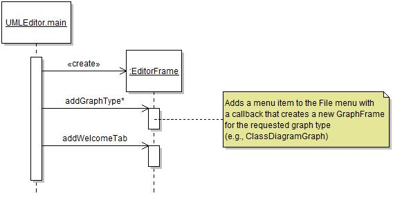

# Frame Management

## Scope

The frame management feature concerns how internal frames are created, activated, de-activated, and closed by either the application or the user.

## Design

At runtime the application is controlled by an instance of `EditorFrame`. The `EditorFrame` object aggregates a `WelcomeTab` instance and any number of `GraphFrame` instances through Java Swing's [tabbed pane mechanism](http://docs.oracle.com/javase/7/docs/api/javax/swing/JTabbedPane.html). Within the methods of `EditorFrame`, the currently selected frame can be obtained through a call to `aTabbedPane.getSelectedComponent()`.

Part of this structure is created at application launch time, and part at diagram creation time. A singleton `EditorFrame` is created, upon which it can be requested to add graph types. However, the `addGraphType` method does not immediately create and add a `GraphFrame` to the application. Rather, it adds a menu item to the `EditorFrame` with a callback that creates the frame when the `new` menu is called. In contrast, the `WelcomeTab` is created at application launch time.

At runtime, only one `JInternalFrame` can be active (or selected) at the time. It is also possible to close frames, which permanently removes them from the application. It is also possible to have multiple frames of the same graph type aggregated by the `EditorFrame`. The state diagram below illustrates the state space for the frame management functionality.

