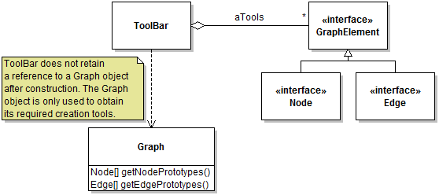

# ToolBar

## Scope

The toolbar feature provides functionality to display a diagram-sensitive toolbar for creating diagrams, and to display a pop-up menu
with all the creation tools in the toolbar.

## Concepts

Conceptually we distinguish between **drawing tools** which include the selection tool and creation tools for different types of nodes and edges, and **general commands** which
are nice to have on the toolbar but do not contribute to diagramming directly (for example, copying the diagram to the clip board). The Toolbar is **collapsible** and can be 
shown either **collapsed** or **expanded**. The toolbar can also be revealed in the form of a **context menu**. In this form however, the toolbar only contains drawing tools and not
the general commands. This is by design. At runtime, the *only* responsibility of the `ToolBar` object is allow the user to select the **active tool** or execute a command.

## Design

### ToolBar Creation

There is one distinct `ToolBar` instance per `GraphFrame`. The `ToolBar` constructor requires
an instance of `Graph` but only uses this instance to obtain the list of nodes and edges to
manage in the toolbar. The reference to the `Graph` object is then discarded. The `ToolBar` constructor
creates the tool icons by calling the `draw` method of the corresponding nodes and edges. The tool icons are thus
drawn and not obtained from icon images.

### Data Structures

The `ToolBar` manages three main data structures: a list of tools (`aTools`), a list of toggle buttons for the collapsed version of the tool bar (`aButtons`), and a list of toggle buttons for the expanded version of the tool bar (`aButtonsEx`). An item at index `i` in any list corresponds to the item at index `i` in any of the other two lists. The lists never change after construction of the `ToolBar` object, so keeping them consistent is not an issue.

The only piece of information that must be kept consistent between the two lists of buttons is which tool is selected. This information is kept inside the `JToggleButton` object and the state is kept consistent between the two button lists through calls to method `synchronizeToolSelection()`.

### Expanding and Collapsing the ToolBar

The change between a collapsed version of the toolbar and an expanded one is achieved simply by swapping an 
expanded version of the tool panel with a collapsed one, or vice-versa. See the code of method `createExpandButton`. Because it was overly complex to manage a single set of toggle buttons that would
somehow be shown in two different parents, the buttons are duplicated and the selected button is syncronized through `synchronizeToolSelection()`.