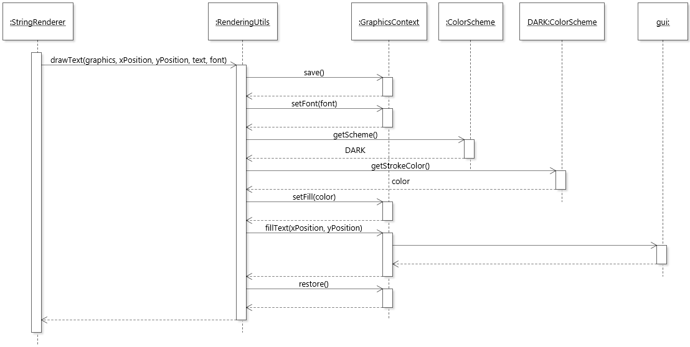

# Dark Mode

## Scope

The Dark Mode feature concerns the components which define the color scheme, the scene graph that the color scheme is applied to, and how the color scheme is integrated in the program.

## Design

There are two components that define the color scheme of the dark mode for the application: `ColorScheme`, an enum class, and a CSS file called `DarkMode.css`. Then, there are the scene graph components the color schemes are applied to. The graph components can also be categorized into two: the `Canvas` (and its diagram elements), and everything else. The everything else refers to components such as the `WelcomeTab`, `MenuBar`, and `ToolBar` - basically, everything that is outside the `Canvas`. Though broad, this is an appropriate categorization because the color scheme of the first is handled by `ColorScheme`, and the latter by `DarkMode.css`.

### Scene Graph

In JavaFX, CSS is applied to `Node` objects hierarchically. That is, once CSS is applied to a `Node`, the styling will cascade down to all its children nodes. Thus, coloring all graph components following a specific color scheme is a simple feat. It is done by adding the CSS file to the `Scene`, the top level container of the application.
 
In JetUML, the CSS file is `DarkMode.css`, and it is applied to the scene of the JetUML application stage, and `DialogStage` by adding the path of the CSS file using `Stage#getScene().getStylesheets().add(String)`. The following defines the `root` style class in `DarkMode.css`:

```css
.root 
{ 
    -fx-accent: #1e74c6;
    -fx-focus-color: -fx-accent;
    -fx-base: #1b1f21;
    -fx-control-inner-background: derive(-fx-base, 35%);
    -fx-control-inner-background-alt: -fx-control-inner-background ;
}
```

CSS style classes can be implemented in two ways, and both are used in `DarkMode.css`. One way is to use predefined JavaFX names mapped to CSS names. For instance, the `root` style class and its properties with the prefix `-fx-` are predefined JavaFX names derived from CSS names, and together, they provide the overall default colors for a node. Simply defining the style class and adding the stylesheet is enough. The other way is to define a custom style class. This requires an extra step, and the style class needs to be added by calling `Node#getStyleClass().add(String). 

### Canvas and Diagram Elements

Unfortunately, CSS does not apply to the `Canvas`, so the elements in the `Canvas` must be colored by modifying the color properties of its `GraphicsContext`. The color scheme of the `Canvas` and diagram elements are defined in the enum `ColorScheme` as `LIGHT` and `DARK`. The idea behind using an enum here is that it captures the colors of all diagram elements corresponding to a scheme in a single place, and is made globally available so that it can be accessed by unrelated parts of the program.

```java
public enum ColorScheme 
{
	LIGHT(Color.WHITE, Color.rgb(220, 220, 220), Color.WHITE, Color.BLACK, Color.color(0.9f, 0.9f, 0.6f), Color.LIGHTGRAY), 
	DARK(Color.rgb(7, 7, 7), Color.rgb(40, 40, 40), Color.rgb(31, 31, 31), Color.WHITE, Color.rgb(30, 63, 102), Color.TRANSPARENT);

	private final Color aCanvas;
	private final Color aGrid;
	private final Color aFill;
	private final Color aStroke;
	private final Color aNote;
	private final DropShadow aShadow;
	
	// constructor

	// getters
	...
}
```
The following sequence diagram shows how `ColorScheme` and `GraphicsContext` is used to render text in diagrams:

1. A StringRenderer object calls RenderingUtils#drawText. 
2. The attributes of the GraphicsContext is saved.
3. The font is set
4. The Fill color is obtained by first retrieving the current ColorScheme (LIGHT or DARK), which depends on the user setting, and getting the stroke color of the text. In the case of text, its fill color is the stroke color of the ColorScheme.
5. The text is rendered.
6. The attributes of the GraphicsContext is restored to its state before the operation.
	
### Tool Bar

`DiagramTabToolBar` is a special case, in that it is styled using a combination of `DarkMode.css`, and `ColorScheme`. The background and `SelectableToolButton`s in the `DiagramTabToolBar` is styled using CSS, while the button icons are `Canvas` objects, so they depend on `ColorScheme` and `GraphicsContext` in the same way the main `Canvas` does.  `DiagramTabToolBar` also aggregates a `ContextMenu`, which appears with the same tools as the `DIagramTabToolBar` when right-clicking on the `Canvas`, and it is styled in the same way as the `DiagramTabToolBar`.

Whenever dark mode is turned on or off, the icons of the tool bar buttons, which represent diagram elements such as nodes and edges, also need to be updated. This is done by calling `recreateButtonIcons()`, which collects all the buttons in `DiagramTabToolBar` and `ContextMenu`, and creates new `Canvas` instances for the icon of each `SelectableToolButton`. 

```java
private void recreateButtonIcons()
	{
		List<Node> toolBarItems = getItems();
		List<MenuItem> contextMenuItems = aPopupMenu.getItems();
		for( int i = 0; i < toolBarItems.size(); i++ )
		{
			ButtonBase button = (ButtonBase) toolBarItems.get(i);
			if( toolBarItems.get(i) instanceof SelectableToolButton toolButton && 
					toolButton.getPrototype().isPresent() )
			{
				button.setGraphic(aDiagramRenderer.createIcon(toolButton.getPrototype().get()));
				contextMenuItems.get(i).setGraphic(aDiagramRenderer.createIcon(toolButton.getPrototype().get()));
			}
		}
	}
```