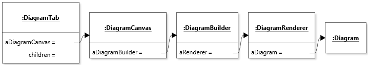
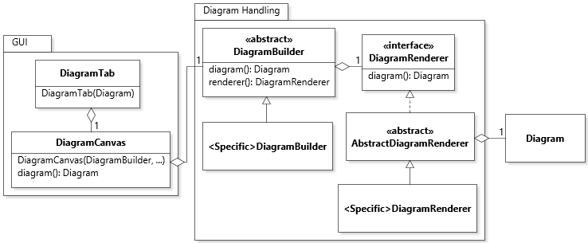

# Diagram Statement Management

## Scope

_Diagram state management_ concerns how the state of a diagram is managed by the UI and other objects that need access to it.

## Design

The state of a diagram and the operations available to manipulate it are available via a layered architecture, wherein a simple diagram data model is aggregated by objects of increasing complexity. **The important principle guiding this design is that each diagram tab manages a single diagram, which is supported by stateful wrappers that always remain consistent with it.**

The objects involved in this design are:
* `Diagram`: The simple data model for a diagram: nodes and edges.
* `DiagramRenderer`: A wrapper that can compute the geometry of the diagram. This wrapper has additional state to cache computations and support global path planning of edges.
* `DiagramBuilder`: Wrapper around a `DiagramRenderer` that provides business rules for modifying a diagram while preserving its validity.
* `DiagramCanvas`: The area of the GUI where the diagram is visually displayed.
* `DiagramTab`: The top-level GUI component that hosts the diagram canvas.

To keep the diagram state management principled, **references to the diagram should be obtained via the highest-level wrapper available and not aliased.** Each class in the design provides getter methods for obtaining the lower wrappers in the layered architecture. This design feature is illustrated in the following diagram.

For example, within `DiagramCanvas`, the diagram is obtained by calling `aDiagramBuilder.diagram()`, and similarly for obtaining the renderer. 