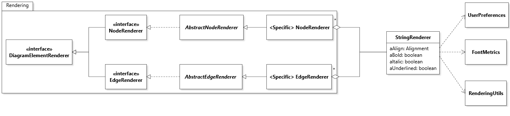

# Font Rendering

## Scope

_Node Storage_ concerns how the bounds (bounding box) of nodes are stored during the execution of the `DiagramRenderer#draw` method. This is a performance feature to avoid the inefficiency of continually re-computing the bounds of nodes during a single diagram rendering pass. The principle behind the Node Storage feature is that the bounding box for a node should only be computed _once for a given diagram rendering pass_. Because bounding boxes are used in many calculations for node and edge placement, it is necessary to cache the computed value to avoid repeatedly recomputing it.

## Overall Design

The feature is supported by a `NodeStorage` object that maps individual nodes to their corresponding bounds `Rectangle`. `NodeStorage` objects are managed by node renderers. In this way, a given node renderer, say `NoteNodeRenderer`, will cache the bounds for all the `NoteNode`s of a given diagram. 

The following class diagram illustrates how the design is realized with the illustration of a `NoteNode` (a node that represents a note on a UML diagram).



* The (Class)`DiagramRenderer` declares two methods to manage node caching. `activateNodeStorages()` prepares and activates the cache by going through all its viewers and activating _their_ cache. It should be called once before a diagram is drawn. `deactivateAndClearNodeStorages()` clears the cache by going through all the viewers and clearing _their_ cache. It should be called once after a diagram is drawn. 
* For nodes, method `getBounds(DiagramElement)` of interface `DiagramElementRenderer` is implemented by a final method in `AbstractNodeRenderer` that delegates the call to `getBounds` of class `NodeStorage`. This call takes as second argument a `Function<Node,Rectangle>` that is the _bounds calculator_. This function object is use to compute the bounds in case of a cache miss. The design of the bounds calculation mechanism is described below.

The following sequence diagram illustrates a scenario where a diagram that contains a single `NoteNode` is drawn.


1. The top section shows the activation of the node storages (caches). What's important to note here is that in practice the `DiagramRenderer` aggregates many `NodeVRenderer` objects, so the call to `activateNodeStorage()` will be repeated once for each element renderer managed by the diagram renderer.
2. The middle section shows how the call to `DiagramRenderer#draw` eventually reaches `NoteNodeRenderer#getBounds`, because this information is used to draw the node. This results in a call to `NodeStorage#getBounds` where the second argument (`::internalGetBounds`) is a _reference to a instance method of a particular object_, namely method `internalGetBounds` of the `NoteNodeRenderer` object.
3. Because there's a cache miss (the bounds of the note node were never previously computed), the bounds calculator `internalGetBounds` is called to compute and return the bounds.
4. The bottom section is very similar to the top section, except that now the node storages are cleared.

## Bounds Calculation Mechanism

The `NodeStorage` class is responsible for caching the bounds of different nodes, and computing these bounds for any node not in the cache. This computation requires specialized algorithms to compute the bounds of different nodes. To make it possible to reuse the `NodeStorage` class for all different types of nodes, its method `getBounds` takes as second argument a _bounds calculator_ function object of type `Function<Node, Rectangle>`. The concrete bounds calculators are implemented as protected methods of the `NodeRenderer` subclasses that implement the abstract method `AbstractNodeRenderer#internalGetBounds`. For example, in the class diagram above, `NoteNodeRenderer` implements `internalGetBounds` with the code to compute the bounds of `NodeNode`s. With this design in place, the implementation of `AbstractNodeRenderer#getBounds` is greatly simplified as:

```java
@Override
public final Rectangle getBounds(Node pNode)
{
	return aNodeStorage.getBounds(pNode, this::internalGetBounds);
}
```

Here, the expression `this::internalGetBounds` is a reference to method `internalGetBounds` of the `NodeRenderer` object upon which `getBounds` gets called. As illustrated in the sequence diagram, when there is a cache miss, this method will be the one called to compute the node's bounds.