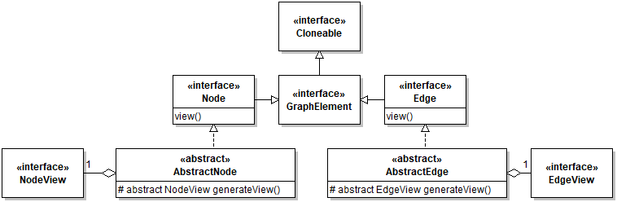
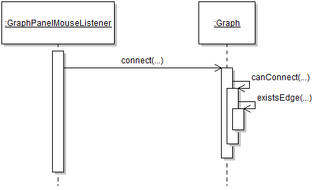

# Edge Hierarchy

## Scope

The graph elements feature concerns how graph elements are defined, managed, and viewed in a diagram.

## Design

In, nodes and edges in a diagrams are represented by instances of interface `GraphElement` and its two sub-interfaces: `Node` and `Edge`. `GraphElement`s are strictly concerned with storing and managing logical data about elements, which explicitly excludes anything related to the visual rendering of the element. Concrete `Node` and `Edge` classes are defined in the `...graph.nodes` and `...graph.edges` packages, respectively. Classes in these packages **must not** depend on any drawing APIs. 

The visual rendering of graph elements is accomplished by appropriate `View` objects. The view for a graph element is obtained using the `view()` method. For example, to draw a node, one would do `node.view().draw(...)`. 

Graph elements are connected with their views by implementing the abstract method `generateView()`, which returns the view that will render the element. This mechanism is necessary as opposed to a constructor because of cloning: When a node is cloned, it's important that a fresh view is generated for the clone. The fresh wrapping is done in `AbstractNode.clone()` and `AbstractEdge.clone()`, respectively.

The choice of how to semantically organize edge types into classes is very important. For example, class diagrams distinguish between aggregation, composition, inheritance, and implementation edges. These four edges types are supported by only two classes, each of which having a `aType` field enabling the distinction between the two additional types (e.g., Inheritance generalization vs. Implementation generalization). 

This decision supports two important benefits:
1. When the edge type is a property, it can be changed without having to re-draw the edge. For instance, an inheritance relation can be simply redefined as an implementation relation.
2. There is a constraint limiting the graphs to have a single edge of any type between two nodes (where direction is taken into account). So by making composition and aggregation edges implemented by the same class, we make it impossible for users to (incorrectly) draw diagrams having both an aggregation and a composition edge starting and ending at the same two nodes. This constraint is checked at edge creation:

