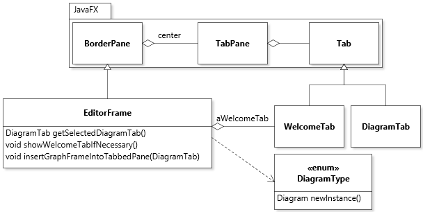
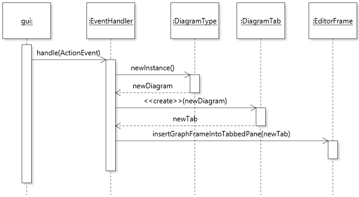

# Tab Management

## Scope

The tab management feature concerns how tabs are created, activated, de-activated, and closed by either the application or the user.

## Design

At runtime the application is controlled by an instance of `EditorFrame`. The `EditorFrame` object aggregates a `WelcomeTab` instance and any number of `DiagramTab` instances through JavaFX's [tabbed pane mechanism](https://docs.oracle.com/javase/10/docs/api/javafx/scene/control/TabPane.html). Within the methods of `EditorFrame`, the currently selected frame can be obtained through a call to `getSelectedDiagramTab()`.

The `WelcomeTab` is created as part of the instantiation of `EditorFrame`, and is only shown if no other diagram is visible. This functionality is achieved through the use of the method `showWelcomeTabIfNecessary()`. In contrast, `DiagramTab` instances are created (and inserted into the `TabPane`) and destroyed (and removed from the `TabPane`) through user operations. The method to insert a `DiagramTab` into the `TabPane` is `insertGraphFrameIntoTabbedPane(DiagramTab)`, which is called through the event handlers for the `File | New | [DiagramType]` menus.

A new `DiagramTab` instance is created whenever a new menu is selected (or a file is open). The following scenario shows the response to the selection of a new diagram menu:

