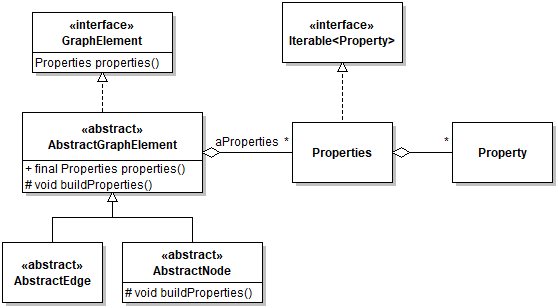
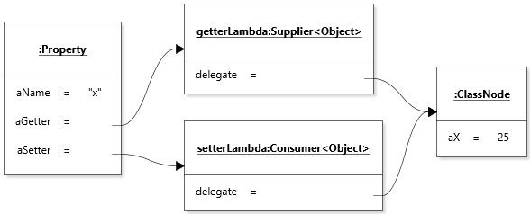

# Diagram Element Properties

## Scope

The Diagram Element Properties feature concerns how the domain-related state of diagram elements (nodes and edges) is captured, initialized, and made available to the rest of the application.

## Design

The state of diagram elements (i.e., instances of `DiagramElement`) can be separated into two categories:
* *Application-related* state, such as the reference to their `View`, or the parent or children nodes of hierachical nodes;
* *Domain-related* state, which captures the properties of a diagram element that define it intrinsically (e.g., the name of a node, whether a call edge is a signal or not, etc.).

Elements of domain-related state are referred to as *properties*. Properties are involved in three areas of the application:
* Properties must be obtained and set to persist or retrieve diagrams to/from file storage;
* Properties must be obtained to draw diagrams elements;
* Properties can be viewed and edited explicitly by the user through a `PropertySheet`.

Prior to Release 2.0, properties of diagram elements were accessed through the [JavaBeans Framework](https://docs.oracle.com/javase/8/docs/api/java/beans/package-summary.html). This was replaced in Release 2.0 with a special-purpose internal property feature because the JavaBeans framework was too heavy and brittle for the relatively simple requirements of JetUML.

The main elements in the design of the properties feature are as follows:



### Defining a Property

An instance of `Property` consists of four pieces of information:
* The name of the property
* Whether the property is *visible* (to users) or not. This bit of information is used by the GUI when generating the property page
for a diagram element.
* A *setter* for the property.
* A *getter* for the property.

The getter and setter are references to objects whose method will obtain (`get`) or set (`accept`) the value of the property. These are intended to be supplied through lambda expressions. With this design, a separate object (the property) thus becomes a proxy for a small part of the state of a diagram element. Although technically the getter and setter used to initialize a `Property` instance could be defined to get and set values on *different* objects, this is not an intended use: a given property should always get and set values *on the same object*. The following object diagram shows a `Property` instance to represent the X-coordinate of a `ClassNode`.



### Property Collections

A collection of `Property` instances for a given `DiagramElement` object is aggregated into a `Properties` object. A `Properties` object is essentially an order-preserving map between property names and the corresponding `Property` object, together with a number of convenient methods for creating properties and adding them to the collection. Order is important because other parts of the application (typically the GUI) will want to rely on a predictable iteration order for presenting properties to users. Properties are made available through the `properties()` method, defined in the `DiagramElement` interface.

Given the above design, getting and setting the value of a property is done as follows:

```java
ClassNode node = ...
int x = node.properties().get("x").get();
node.properties().get("x").set(25);
```

Note that this example uses autoboxing.

### Initializing Properties

Initializing properties is a bit tricky because instances of `DiagramElement` must be `Cloneable`, which rules out exclusive constructor-based initialization. The protocol for creating a `Properties` object for a `DiagramElement` is thus triggered by a call to `buildProperties()`, which is called by both the constructor and `clone()` method of `AbstractDiagramElement`. The idea is that `buildProperties()` is overridden by subclasses, which however call `super.buildProperties()` as the first statement of the method. The call chain thus propagates up to `AbstractDiagramElement.buildProperties()`, which initializes a fresh (empty) `Properties` object, and then back down into the method of each subclass, which can then add the properties that correspond to the fields defined in the subclass.

The following code, in class `InterfaceNode`, illustrates this protocol:

```java
@Override
protected void buildProperties()
{
   super.buildProperties();
   properties().add("methods", () -> aMethods, pMethods -> aMethods = (String)pMethods);
}
```

The super call binds to `NamedNode.buildProperties()`, which then calls `super.buildProperties()` and so on. When all superclasses have contributed their properties, control returns to `IntefaceNode.buildProperties()`, which adds the "methods"
property (the text that describes the methods of an interface).
