# User Guide

This page contains the complete list of "tips" available through JetUML's "Tip of the Day" dialog. Click on an entry to expand with details.

<button class="collapsible">Beginner</button>

<button class="collapsible">Creating Nodes</button>

Selecting a node type in the toolbar enables the corresponding Node Creation tool. With a Node Creation tool enabled, click on an empty space in the diagram to create a new node of that type. Rolling over the tool in the toolbar shows a tooltip with the name of the node type.

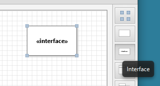

<button class="collapsible">Creating Edges</button>

To create an edge between two nodes, select an Edge Creation tool in the toolbar, click in the start edge, then start dragging with the mouse. This will enable a rubber band view of the start and end nodes for the edge. Release the mouse on the destination edge to complete the operation. Edges are laid out automatically: to control their path it is necessary to move their start and end nodes. The edge creation operation will not have any effect if the edge type is not a valid way to connect the selected nodes.

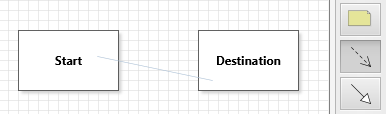

<button class="collapsible">Selecting Diagram Elements</button>

To select diagram elements individually, enable the Selection tool and click on the element to select or deselect. To add or remove individual elements to/from the selection, hold down the Ctrl key while clicking on the element.

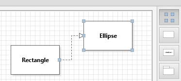

<button class="collapsible">Selecting With the Lasso Tool</button>

To select all elements in a region of the diagram, enable the Selection Tool, then click and drag from an empty space in the diagram. This will enable the Lasso tool. 

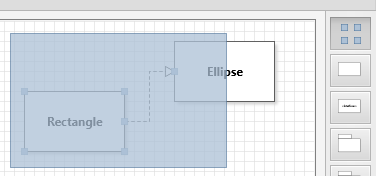

<button class="collapsible">Editing Element Properties</button>

You can edit an element's properties by double-clicking it or by using the shortcut Ctrl-Enter on a selected element.

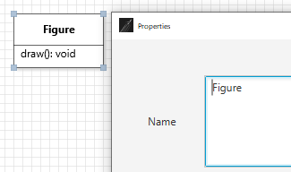

<button class="collapsible">Tool Hints</button>

It is possible to view the name of each tool in the toolbar in full next to its icon. To toggle this feature, use the menu command View | Show Tool Hint.

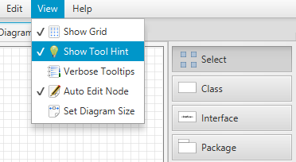

<button class="collapsible">Popup Toolbar</button>

The toolbar is also available as a popup menu. Right-click anywhere to show it.

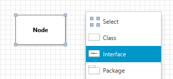

<button class="collapsible">Selecting Everything</button>

Use the menu command Edit | Select All (Ctrl-A) to select all elements in a diagram, for example to move the entire diagram as one.

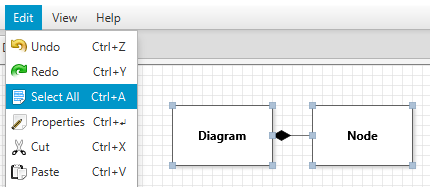

<button class="collapsible">Creating Note Elements</button>

Use Note elements to annotate the diagram with complementary information.

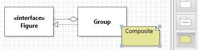

<button class="collapsible">Edge Labels</button>

Certain types of edges can have associated labels. Edit the edge properties by double-clicking the edge or using the Ctrl-Enter shortcut.

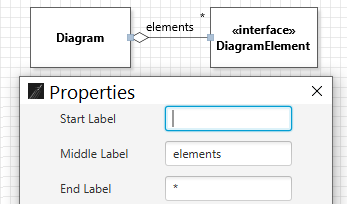

<button class="collapsible">Verbose Tooltips</button>

Use the menu command View | Verbose Tooltips to toggle verbose tooltips in the toolbar. Verbose tooltips provide an extended description of the meaning of UML elements available in the toolbar.

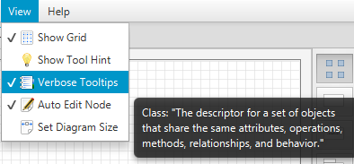

<button class="collapsible">Adding Fields to Objects</button>

To add a field to an object, select the Field Creation tool from the toolbar and click within the desired object node. Accessing the fields' properties (Ctrl-Enter) allows to change the field's name and value.

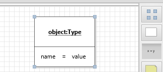

<button class="collapsible">Adding Object References</button>

To add a reference to an object, select the Reference Creation tool from the toolbar, then drag a rubber band from the Value part of a field to the destination object node.

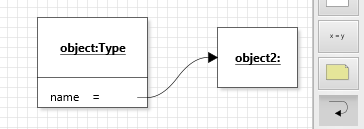

<button class="collapsible">Copying the Diagram to the Clipboard</button>

Use the Copy to Clipboard feature to copy a snapshot of the entire diagram to the system clipboard. The diagram can then be pasted easily into other applications. The feature is accessed using the File menu, the toolbar, or using the shortcut Ctrl-B.

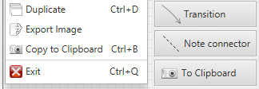

<button class="collapsible">Creating Call Edges</button>

To create the initial call edge in a sequence diagram, select the Call Edge Creation tool and drag the rubber band from the life-line of the caller to the life-line of the callee.

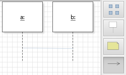

This will create the activation box for both the caller and the callee. To create additional call edges, drag from an activation box to a life-line.

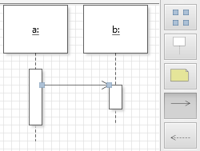

<button class="collapsible">Setting the Size of Diagrams</button>

In JetUML diagrams have a fixed size. To change this size, use the menu command View | Set Diagram Size. The size will be used when creating new diagrams or opening diagram files. When opening a diagram, the size is automatically increased to fit the diagram if necessary. Larger diagrams decrease the tool's performance. The default values are in relation to the display size.

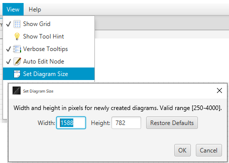

<button class="collapsible">Showing or Hiding the Grid</button>

It is possible to control whether the grid is visible or not in a diagram. Use the menu command View | Show Grid to toggle this option. Diagram elements automatically snap to the grid whether it is visible or not.

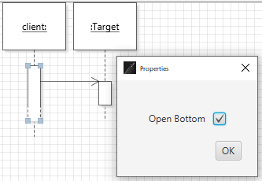

<button class="collapsible">Zooming the Diagram</button>

It is possible to zoom the diagram in and out up to a maximum of two levels in both directions. The commands are available through the View menu and through the shortcuts Ctrl-= (Zoom In), Ctrl-- (Zoom Out), and Ctrl-0 (Reset Zoom).

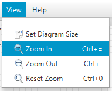

<button class="collapsible">Exporting the Diagram</button>

Use the menu command File | Export Image to save the current diagram as an image file. The image type is determined by the file extension selected from the Save as Type field.

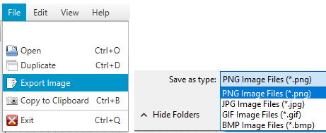

<button class="collapsible">Changing the Font</button>

Use the menu command View | Change Font to change the font and size of the font used in the diagram. This setting only affects how the diagram looks.

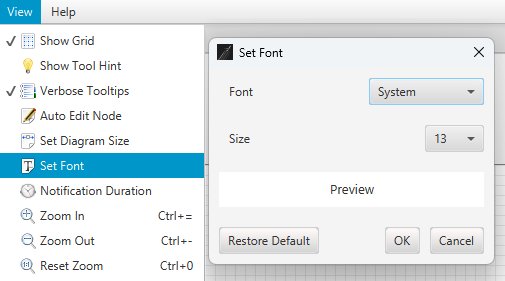

<button class="collapsible">Notifications</button>

Errors and confirmations get reported as temporary notifications in the bottom left of the application window. It is possible to adjust the duration of the notifications. A duration of zero disables all notifications.

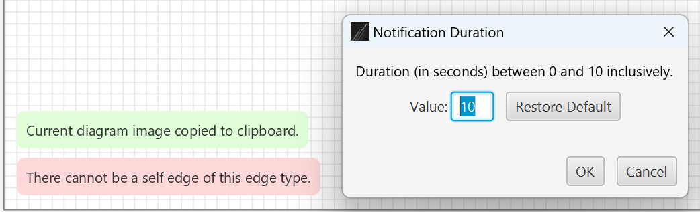

<button class="collapsible">Dark Mode</button>

You can turn dark mode on or off by navigating to the menu command View | Dark Mode.

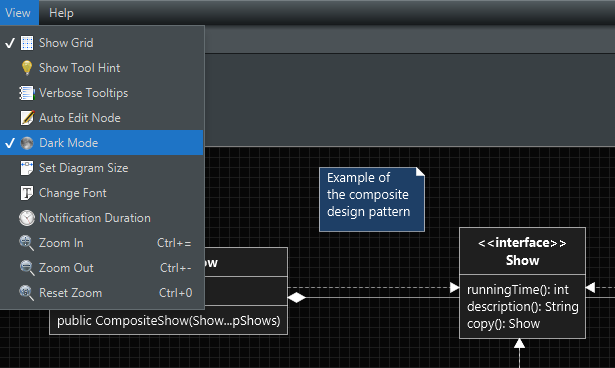

<button class="collapsible">Intermediate</button>

<button class="collapsible">Edge Validation</button>

When attempting to create a new edge, the operation will only succeed if the edge is a valid connection between two elements according to the syntax of the diagram. Invalid attempts to create edges get reported as notifications.

<button class="collapsible">Adding Self-Edges</button>

Certain types of edges can be added from an element to itself. To create a self-edge, select a valid edge type and drag the rubber band within a compatible node.

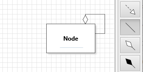

<button class="collapsible">Changing the Type of an Edge</button>

Certain types of edges can be changed through the edge's properties. Access the edge properties by double-clicking an edge or selecting it and typing Ctrl-Enter.

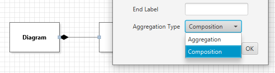

<button class="collapsible">Linking Note Elements</button>

Use the note edge to link notes to various parts of the diagram. Dragging a note edge from a target node to the note node will link the note node with the target node. Dragging a note edge from the note node will anchor the edge to a fixed point on the diagram.

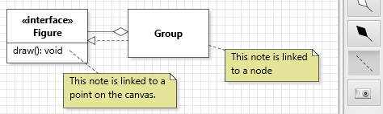

<button class="collapsible">Tool Shortcuts</button>

The tools in the toolbar can be selected by pressing the "1" key for the first tool,"2" for the second, etc. The sequence 1-9,0,A,B... provides direct access to all the tools in the toolbar, from top to bottom.

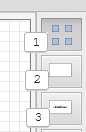

<button class="collapsible">Cutting, Copying, and Pasting</button>

You can cut or copy one or more diagram elements and paste them either within the same diagram or into a different diagram. It is only possible to paste a selection to another diagram if all the elements in the selection are compatible with the destination diagram type. It is also not possible to paste elements into a sequence diagram as this would result in an invalid control-flow sequence.

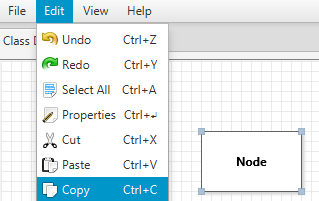

<button class="collapsible">Automatically Editing Newly Created Nodes</button>

To speed up diagramming, use the Auto Edit Node feature to automatically open the properties page whenever a new node is created. This feature is only available for nodes.

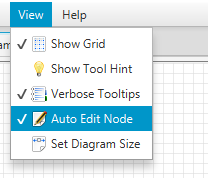

<button class="collapsible">Duplicating a Diagram</button>

Use the menu command File | Duplicate (Ctrl-D) to quickly make a duplicate of the current diagram. The duplicate diagram will be open in a new tab. This feature is especially useful when exploring different variants of a design.

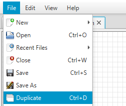

<button class="collapsible">Sequence Diagram Validation</button>

JetUML verifies that call and return edges added to a sequence diagram result in a valid control sequence. Trying to add edges at arbitrary points that would result in a jump in the control flow will fail silently.

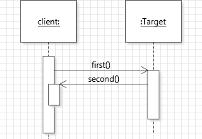

<button class="collapsible">Adding Self-Calls in Sequence Diagrams</button>

JetUML supports self-calls in sequence diagrams. To create a self-call, select the Call Edge Creation tool and drag the rubber band within an activation box.

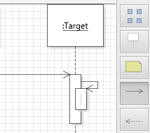

<button class="collapsible">Inserting Stereotype Delimiters</button>

In the Properties editor for any diagram element, use the shortcut key combination Ctrl-Q to insert the characters « », which are the delimiters for UML stereotypes. The cursor will be positioned between the delimiters, so you can just continue typing the name of your stereotype.

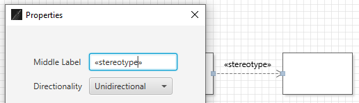

<button class="collapsible">Advanced</button>

<button class="collapsible">Transitions in State Diagrams</button>

State diagrams support up to two transitions between nodes in either direction, as well as two self-transitions.

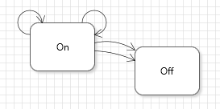

<button class="collapsible">Adding Constructor Calls in Sequence Diagrams</button>

With JetUML you can represent constructor calls in sequence diagrams. To add a constructor call, select the Call Edge Creation tool and drag the rubber band from a source life-line or activation box to the implicit parameter node.

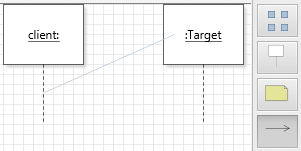

The call will be shown with the label «create» and the implicit parameter will be positioned vertically aligned with the call. An activation box will be attached to the implicit parameter: use it to model calls that originate from the constructor.

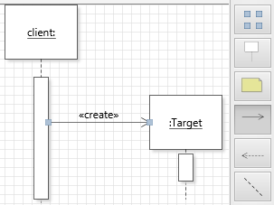

<button class="collapsible">Adding Child Nodes to Packages</button>

Package nodes can contain child nodes. To add a child node to a package, select the desired Node Creation tool and click within a package to add this node directly as a child node. To add an existing node to a package, position the node on top of the package and hit the Shift key. To detach a node from a package, also hit the Shift key.

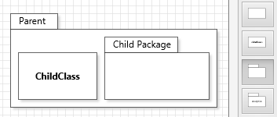

<button class="collapsible">Representing Incomplete Call Sequences</button>

Use the Open Bottom property of the activation box in a sequence diagram to represent an incomplete sequence of calls.

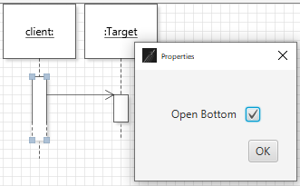

<!-- Source: https://www.w3schools.com/ -->
