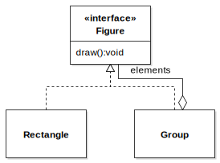
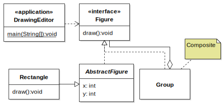

# JetUML User Guide

For JetUML Version 3.9. Updated 2025-08-28.

* [Main Features](#main-features)
* [A Quick Tour of JetUML](#a-quick-tour-of-jetuml)
* [Tips for JetUML Users](#tips-for-jetuml-users)

## Main Features

The essential features of JetUML. 

1. **Automatic Edge Layout.** JetUML automatically lays out the edges that represent association between elements. The paths are computed using custom algorithms intended to give the diagrams a clean and natural look. To change the path of an edge, simply move the nodes around. 

2. **Five Diagram Types.** JetUML currently supports [class diagrams](https://en.wikipedia.org/wiki/Class_diagram), [sequence diagrams](https://en.wikipedia.org/wiki/Sequence_diagram), [state diagrams](https://en.wikipedia.org/wiki/UML_state_machine), [object diagrams](https://en.wikipedia.org/wiki/Object_diagram), and [use case diagrams](https://en.wikipedia.org/wiki/Use_case_diagram). (See the menu  _File > New_)

3. **Semantic Diagram Validation.** When creating a diagram, JetUML checks to ensure that the diagram is valid and reports problems using pop-up notifications.

4. **Copy to Clipboard.** With a single command, copy the current diagram to the clipboard without the background grid, and with just the right bounding box. The diagram can then easily be pasted into chat programs, slide presentations, etc. (_File > Copy to Clipboard_)

5. **Export to Image File.** Export a diagram to an image file. Supported formats include [SVG](https://en.wikipedia.org/wiki/SVG), [PNG](https://en.wikipedia.org/wiki/PNG), [JPEG](https://en.wikipedia.org/wiki/JPEG), and more. (_File > Export Image_)

6. **Duplicate Diagram.** With a single command, duplicate the current diagram to explore different design alternatives. (_File > Duplicate_)

7. **Customizable Interface.** View additional hints and documentation directly in the user interface, switch to dark mode, change the font, hide the grid, etc. (See the _View_ menu)

8. **Open file format.** JetUML saves diagram in [JSON](https://en.wikipedia.org/wiki/JSON) files using a [documented format](schemas.md). Diagrams can thus be accessed and manipulated outside of JetUML. (_File > Save_)

## A Quick Tour of JetUML

Once you have JetUML [up and running](install.md), follow these instructions for a quick tour through the application that will demonstrate most of its features. 

### Part 1: A Simple Sketch

In this first part, you will create a very simple UML sketch. 

Once you have the hang of it, you'll be able to create this diagram in approximately 30 seconds.

1. Start JetUML: you will see the _Welcome Tab_. Under _Create New Diagram_, select _Class Diagram_. You will now see a blank _canvas_.

> **NOTE:** If you prefer to work in dark mode, select the menu option View > [Dark Mode](#38-dark-mode).

2. To the right of the canvas is the _tool pane_. We will use it to create an interface element in our diagram. In the tool pane, select the third element down from the top. Its tool tip should say "Interface". With the _interface (creation) tool_ activated, click anywhere on the canvas to [create the interface element](#2-creating-nodes).

> **NOTE:** If you are not yet familiar with the UML, select View > [Show Tool Hint](#8-tool-hints) to display labels next to the icons in the tool bar. You can also select View > [Verbose Tooltips](#18-verbose-tooltips) to show an extended description of each UML element though their tool tip.

3. You will now _[edit the properties](#6-editing-element-properties)_ of the interface element. Either double-click the element, or [select it](#4-selecting-diagram-elements) and press Ctrl-Enter. Its _property sheet_ will appear. Under _Name_, type `Figure`. In the box for _Methods_, type `draw():void`. Note that you can tab between fields in a property sheet.

To sketch out this diagram as fast as possible, we will use the [_auto-edit_ feature](#24-automatically-editing-newly-created-nodes), which automatically opens the property sheet whenever an element is created. 

4. Select View > Auto Edit Node. You can turn this feature off whenever it is no longer necessary.
5. Select the _class (creation) tool_ from the toolbar (second button from the top).
6. Click on the canvas. A class element is created and its property sheet opens. Type `Figure` then hit the Esc key to close the dialog. Repeat the process for another element with the name `Group`. Position both elements below the interface element.
7. You will now [add the edges](#3-creating-edges) to the diagram. In the toolbar, select the _Realization_ edge (ninth button from the top). Then click inside the `Rectangle` element, hold and drag, and release the mouse button inside the `Figure` element. A realization edge will be created linking the two elements. Repeat the process to add a realization edge between the `Group` and the `Figure` elements. Note how the edges automatically align and merge to produce a compact diagram.
8. To create the _aggregation edge_ between the `Group` and the `Figure` elements, select the _Aggregation Edge (creation)_ tool in the tool bar, then drag the mouse between the `Group` and the `Figure` elements.
9. To add the `elements` label to the aggregation edge, select the _Selection Tool_ (first element in the tool bar), then double-click the edge. The property sheet will open. Type `elements` in the _Middle Label_ field and hit the Esc key to close the property sheet. 

> **NOTE:** You can use the property sheet to change any of the elements property, including alternating between association and composition.

10. To finalize your first UML sketch, move the nodes around until the diagram looks the way you want.

At this point, you have already created a valid UML sketch with JetUML. You can:

* Save your diagram to open it again later, using File > Save As;
* [Export the diagram](#34-exporting-the-diagram) as an image using File > Export Image;
* [Copy it to the clipboard](#22-copying-the-diagram-to-the-clipboard) using File > Copy to Clipboard or (even better) its corresponding shortcut key. Try pasting it in a suitable application, for example a slide presentation.

### Part 2: Additional Features

You will now expand your initial sketch to explore a different design, and at the same time discover additional features of JetUML, by creating the following diagram.

1. Ensure you have the sketch from Part 1 in a class diagram tab. If you closed the application after Part 1 and saved your diagram, load it back with File > Open. Otherwise, simply recreate it (it should now be very quick).
2. Duplicate the diagram by using File > [Duplicate](#25-duplicating-a-diagram) or its corresponding shortcut key. JetUML will open a new tab with the same diagram, allowing you to modify it while keeping your first version around.
3. To turn the `Rectangle` class into an abstract class, open its property sheet and change the name from `Rectangle` to `/AbstractFigure/`. The [slashes](#39-underlining-or-italicizing-text) before and after the name will tell JetUML to render it in italics, which is the UML convention for abstract elements. While you are at it, add a field `x:int` and `y:int` in the _Attributes_ box.
4. Using the class creation tool, create a new element and name it `Rectangle`. Add a method `draw():void` to its _Methods_ property.
5. You will now indicate that `Rectangle` _inherits_ from `AbstractFigure`. But first, let's try something silly: to make `Rectangle` inherit from itself. Select the inheritance tool from the tool bar, and drag an edge _between two points within the `Rectangle` element!_ The edge won't get created, and you should see a [notification](#37-notifications) indicating that this is not possible. JetUML's _semantic checking_ prevents numerous modeling errors in this way. With the inheritance tool still selected, now drag from the `Rectangle` to the `AbstractFigure` element, to properly mode the relationship.

> **NOTE:** You can adjust the duration of the notifications with View > [Notification Duration](#37-notifications). 

6. You will now add the `Drawing` class. Create a class element as usual. However, this element has a [stereotype](https://en.wikipedia.org/wiki/Stereotype_(UML)) `«application»`. To easily [add the French quotes](#36-inserting-stereotype-delimiters), enter Ctrl-Q. Also add the `main` method to the _Methods_ properties, as you have done above. In UML class diagram, static members should be underlined. To show the `main` method as underlined, add an underscore before and after it, e.g., `_main(String[]):void_`. 
7. To show the dependency between the `Diagram` and the `Figure` elements, select the dependency create tool and drag from `Drawing` to `Figure`. Double-click on the new dependency to open its property sheet, and notice how you can add a label or even change the directionality of the dependency. Close the property sheet.
8. To complete the diagram you will add a [_note_ element](#13-creating-note-elements) to indicate that `Group` fulfills the role of a composite in the Composite design pattern. Using the note creation tool, add a note element and edit its property to add the text `Composite`. To [link the note](#14-linking-note-elements) to the group class, select the node connector tool and drag _from_ the `Group` element _to_ the node element. The note will then be connected to the `Group` class: if you move it around, the connector will stay connected to it.

> **NOTE:** To connect a note element to an arbitrary point on the canvas, drag instead _from_ the note element to the desired point.

That's it! You're now ready to create your own models in the blink of an eye. Modeling with the other diagram types works the same way: select a tool, create node elements, and connect them with edges. For additional tips, see below.

## Tips for JetUML Users

This section lists all the "Tip of the Day" entries available through JetUML's help menu.

### 1. Creating a New Diagram

You can create a new diagram at any point using the menu command File > New. The diagram will open in a new tab.

### 2. Creating Nodes

Selecting a node type in the toolbar enables the corresponding Node Creation tool. With a Node Creation tool enabled, click on an empty space in the diagram to create a new node of that type. Rolling over the tool in the toolbar shows a tooltip with the name of the node type.

### 3. Creating Edges

To create an edge between two nodes, select an Edge Creation tool in the toolbar, click in the start edge, then start dragging with the mouse. This will enable a rubber band view of the start and end nodes for the edge. Release the mouse on the destination edge to complete the operation. Edges are laid out automatically: to control their path it is necessary to move their start and end nodes. The edge creation operation will not have any effect if the edge type is not a valid way to connect the selected nodes.

### 4. Selecting Diagram Elements

To select diagram elements individually, enable the Selection tool and click on the element to select or deselect. To add or remove individual elements to/from the selection, hold down the Ctrl key while clicking on the element.

### 5. Selecting With the Lasso Tool

To select all elements in a region of the diagram, enable the Selection Tool, then click and drag from an empty space in the diagram. This will enable the Lasso tool. 

### 6. Editing Element Properties

You can edit an element's properties by double-clicking it or by using the shortcut Ctrl-Enter on a selected element.

### 7. Edge Validation

When attempting to create a new edge, the operation will only succeed if the edge is a valid connection between two elements according to the syntax of the diagram. Invalid attempts to create edges get reported as notifications.

### 8. Tool Hints

It is possible to view the name of each tool in the toolbar in full next to its icon. To toggle this feature, use the menu command View > Show Tool Hint.

### 9. Popup Toolbar

The toolbar is also available as a popup menu. Right-click anywhere to show it.

### 10. Adding Self-Edges

Certain types of edges can be added from an element to itself. To create a self-edge, select a valid edge type and drag the rubber band within a compatible node.

### 11. Changing the Type of an Edge

Certain types of edges can be changed through the edge's properties. Access the edge properties by double-clicking an edge or selecting it and typing Ctrl-Enter.

### 12. Selecting Everything

Use the menu command Edit > Select All (Ctrl-A) to select all elements in a diagram, for example to move the entire diagram as one.

### 13. Creating Note Elements

Use Note elements to annotate the diagram with complementary information.

### 14. Linking Note Elements

Use the note edge to link notes to various parts of the diagram. Dragging a note edge from a target node to the note node will link the note node with the target node. Dragging a note edge from the note node will anchor the edge to a fixed point on the diagram.

### 15. Tool Shortcuts

The tools in the toolbar can be selected by pressing the "1" key for the first tool,"2" for the second, etc. The sequence 1-9,0,A,B... provides direct access to all the tools in the toolbar, from top to bottom.

### 16. Edge Labels

Certain types of edges can have associated labels. Edit the edge properties by double-clicking the edge or using the Ctrl-Enter shortcut.

### 17. Cutting, Copying, and Pasting

You can cut or copy one or more diagram elements and paste them either within the same diagram or into a different diagram. It is only possible to paste a selection to another diagram if all the elements in the selection are compatible with the destination diagram type. It is also not possible to paste elements into a sequence diagram as this would result in an invalid control-flow sequence.

### 18. Verbose Tooltips

Use the menu command View > Verbose Tooltips to toggle verbose tooltips in the toolbar. Verbose tooltips provide an extended description of the meaning of UML elements available in the toolbar.

### 19. Adding Fields to Objects

To add a field to an object, select the Field Creation tool from the toolbar and click within the desired object node. Accessing the fields' properties (Ctrl-Enter) allows to change the field's name and value.

### 20. Adding Object References

To add a reference to an object, select the Reference Creation tool from the toolbar, then drag a rubber band from the Value part of a field to the destination object node.

### 21. Transitions in State Diagrams

State diagrams support up to two transitions between nodes in either direction, as well as two self-transitions.

### 22. Copying the Diagram to the Clipboard

Use the Copy to Clipboard feature to copy a snapshot of the entire diagram to the system clipboard. The diagram can then be pasted easily into other applications. The feature is accessed using the File menu, the toolbar, or using the shortcut Ctrl-B.

### 23. Creating Call Edges

To create the initial call edge in a sequence diagram, select the Call Edge Creation tool and drag the rubber band from the life-line of the caller to the life-line of the callee.

This will create the activation box for both the caller and the callee. To create additional call edges, drag from an activation box to a life-line.

### 24. Automatically Editing Newly Created Nodes

To speed up diagramming, use the Auto Edit Node feature to automatically open the properties page whenever a new node is created. This feature is only available for nodes.

### 25. Duplicating a Diagram

Use the menu command File > Duplicate (Ctrl-D) to quickly make a duplicate of the current diagram. The duplicate diagram will be open in a new tab. This feature is especially useful when exploring different variants of a design.

### 26. Sequence Diagram Validation

JetUML verifies that call and return edges added to a sequence diagram result in a valid control sequence. Trying to add edges at arbitrary points that would result in a jump in the control flow will fail silently.

### 27. Adding Self-Calls in Sequence Diagrams

JetUML supports self-calls in sequence diagrams. To create a self-call, select the Call Edge Creation tool and drag the rubber band within an activation box.

### 28. Adding Constructor Calls in Sequence Diagrams

With JetUML you can represent constructor calls in sequence diagrams. To add a constructor call, select the Call Edge Creation tool and drag the rubber band from a source life-line or activation box to the implicit parameter node.

The call will be shown with the label «create» and the implicit parameter will be positioned vertically aligned with the call. An activation box will be attached to the implicit parameter: use it to model calls that originate from the constructor.

### 29. Setting the Size of Diagrams

In JetUML diagrams have a fixed size. To change this size, use the menu command View > Set Diagram Size. The size will be used when creating new diagrams or opening diagram files. When opening a diagram, the size is automatically increased to fit the diagram if necessary. Larger diagrams decrease the tool's performance. The default values are in relation to the display size.

### 30. Adding Child Nodes to Packages

Package nodes can contain child nodes. To add a child node to a package, select the desired Node Creation tool and click within a package to add this node directly as a child node. To add an existing node to a package, position the node on top of the package and hit the Shift key. To detach a node from a package, also hit the Shift key.

### 31. Showing or Hiding the Grid

It is possible to control whether the grid is visible or not in a diagram. Use the menu command View > Show Grid to toggle this option. Diagram elements automatically snap to the grid whether it is visible or not.

### 32. Representing Incomplete Call Sequences

Use the Open Bottom property of the activation box in a sequence diagram to represent an incomplete sequence of calls.

### 33. Zooming the Diagram

It is possible to zoom the diagram in and out up to a maximum of two levels in both directions. The commands are available through the View menu and through the shortcuts Ctrl-= (Zoom In), Ctrl-- (Zoom Out), and Ctrl-0 (Reset Zoom).

### 34. Exporting the Diagram

Use the menu command File > Export Image to save the current diagram as an image file. The image type is determined by the file extension selected from the Save as Type field.

### 35. Changing the Font

Use the menu command View > Change Font to change the font and size of the font used in the diagram. This setting only affects how the diagram looks.

### 36. Inserting Stereotype Delimiters

In the Properties editor for any diagram element, use the shortcut key combination Ctrl-Q to insert the characters « », which are the delimiters for UML stereotypes. The cursor will be positioned between the delimiters, so you can just continue typing the name of your stereotype.

### 37. Notifications

Errors and confirmations get reported as temporary notifications in the bottom left of the application window. It is possible to adjust the duration of the notifications. A duration of zero disables all notifications.

### 38. Dark Mode

You can turn dark mode on or off by navigating to the menu command View > Dark Mode.

### 39. Underlining or Italicizing Text

To show a line of text in italics, surround it with forward slashes (e.g., /abstract/). To show a line of text underlined, surround it with underscores (e.g., _underlined_).

